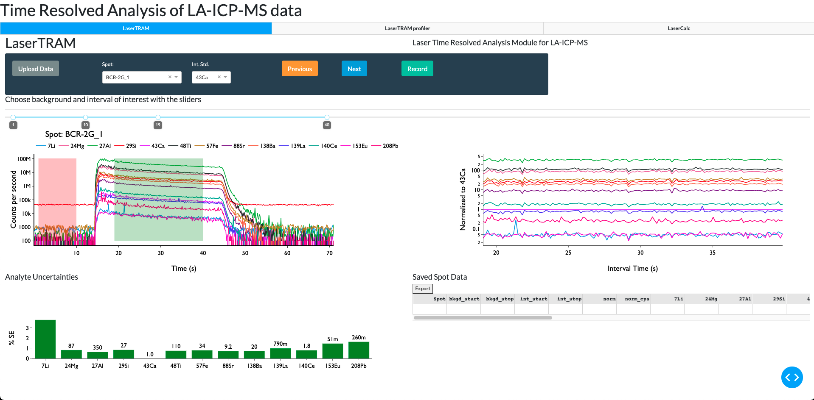
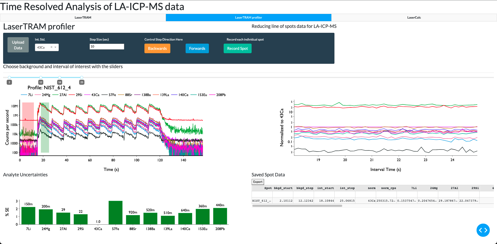
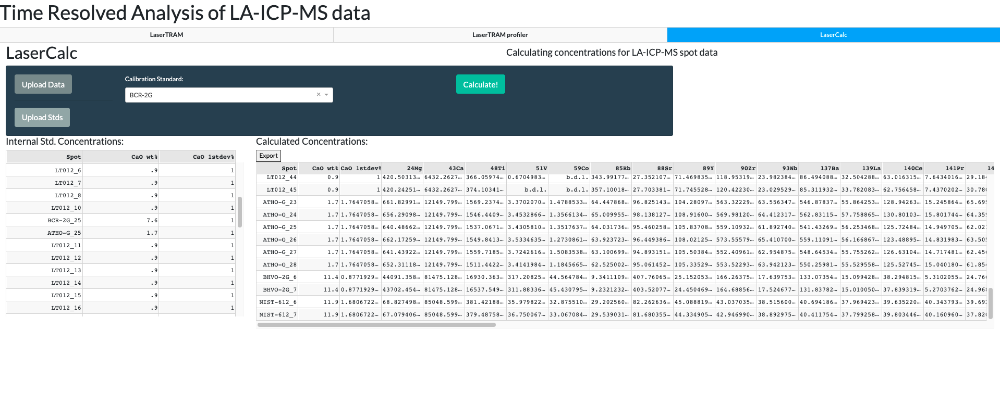

# ```LaserTRAM-DB```: A dashboard for the complete laser ablation icp-ms data reduction pipeline. 

LaserTRAM-DB is a dashboard for the complete processing pipeline of Laser Ablation Inductively Coupled Plasma Mass Spectrometry (LA-ICP-MS) data in complex materials such as geologic samples. As LA-ICP-MS data in geologic samples frequently have multiple phases, inclusions, and other compositional complexities within them that do not represent the material of interest, user interaction is required to filter unwanted signals out of the overall ablation signal. LaserTRAM-DB allows the user to filter which portion of the ablation peak is utilized in calculating concentrations, subsequently allowing for more accurate data to be obtained. Furthermore, it allows for the processing of both individual spot analysis data and a line of spots gathered in rapid succession, reducing the time required for data reduction while preserving spatial definition and still ensuring data quality.

## Statement of Need

With a wide array of applications in the natural sciences (e.g., Caricchi et al., 2020; Fritz-Endres and Fehrenbacher 2021; Loewen and Kent 2012; Lukacs et al., 2021), laser ablation inductively coupled plasma mass spectrometry (LA-ICP-MS) is a now a commonplace tool for the gathering of in situ trace element (i.e., < 0.1 wt%) data from solid materials. The last two decades have seen significant advances in both instrument capabilities and operating software, allowing users to generate large volumes of in situ geochemical data in comparatively little time to previous methodologies (i.e., micro-drilling) while still maintaining high degrees of accuracy and precision.

Raw data output from LA-ICP-MS, however, is in the form of counts per second (cps) for the selected analyte isotopes, not elemental concentrations. In order to be converted into accurate concentrations, a modest amount of user input and interpretation is required and should not be automated. Currently, there are several proprietary and open-source softwares for LA-ICP-MS data reduction to accomplish this task: SILLS - (Guillong et al., 2008); Iolite - (Paton et al., 2011); LAtools - (Branson et al., 2019); Termite - (Mischel et al., 2017); GLITTER - Macquarie University GEMOC; and countless other “in house” spreadsheet-based tools. All have their strengths and weaknesses, however, there is yet to be a powerful, web-hosted Graphical User Interface (GUI). Built primarily using ```Plotly-Dash```, ```numpy```, and ```pandas```, we present a completely open-source dashboard: Laser Time Resolved Analysis Module Dashboard (LaserTRAM-DB) that allows the user to calculate concentrations from raw LA-ICP-MS data with the flexibility of a GUI interface while maintaining the performance of the numerical python ecosystem. Furthermore, by simultaneously displaying both raw data cps and internal standard normalized cps, it allows for rapid decision making about data quality to be determined. It is comprised of three parts:

It is comprised of 3 parts: 
1. **LaserTRAM:** Choosing an interval of interest from raw cps data in individual spot analyses and normalizing it to an internal standard.



2. **LaserTRAM profiler:** Functionally the same as LaserTRAM, however has tools that allow for the rapid inspection of a line of spot analyses gathered in quick succession.



3. **LaserCalc:** Takes the output from either LaserTRAM or LaserTRAM profiler and converts the normalized data into concentrations using the equations outlined below.



## Installation and Use

The easiest way to use LaserTRAM-DB is to use the following link: 

COMING SOON!

Alternatively, LaserTRAM-DB can be installed locally and run by creating a virtual environment. If you are new to python, we recommend doing this through [Anaconda](https://www.anaconda.com/products/individual).

```
git clone https://github.com/jlubbersgeo/laserTRAM-DB
cd /path/to/laserTRAM-DB
conda create -n lasertram-db python=3.7.7
conda activate lasertram-db
conda install --file requirements.txt
python lasertram-db.py
```

When the program is running, copy and paste the provided link provided in the terminal window into the browswer window and the app will run. You can stop the program using ```ctrl+c``` and then exit the virtual environment with:

```conda deactivate```.

From now on any time you wish to use the program, simply re-activate the virtual environment and run the script like above:

```
conda activate lasertram-db
cd /path/to/laserTRAM-DB
python lasertram-db.py
```


## Demos
Video tutorials on how to use each piece of software can be found at the following links:

- [LaserTRAM video](https://www.youtube.com/watch?v=ALVzTdMnS-k&t=338s&ab_channel=JordanLubbers)
- [LaserTRAM profiler video](https://youtu.be/x6FINd_jvps)
- [LaserCalc video](https://www.youtube.com/watch?v=vWmwE5XO5l0&t=1s&ab_channel=JordanLubbers)

## Quickstart

With LaserTRAM-DB up and running, to get started, please watch the videos above in the Demos section. After that, sample data may be found in the "tests" folder:
- LaserTRAM test data: ```spot_test_raw_data.xlsx```
- LaserTRAM profile test data: Any of the following files: ```ATHO-G-7.csv```, ```BCR-2G-12.csv```,```BCR-2G-1.csv```,```BHVO-2G-3.csv```,```unknown_nist.csv```
- LaserCalc test data: ```spot_test_lasertram_complete.xlsx```,```profile_test_lasertram_profiler_complete.xlsx```

## Contributing

One of the main goals of this project is to bring increased transparency to the fields that utilize LA-ICP-MS data. As such, we welcome feedback and suggestions to help improve the software! If you wish to be a part of further development, or have ideas for new features please open an [issue](https://github.com/jlubbersgeo/laserTRAM-DB/issues) here on GitHub or reach out to Jordan Lubbers (lubbersj@oregonstate.edu).

