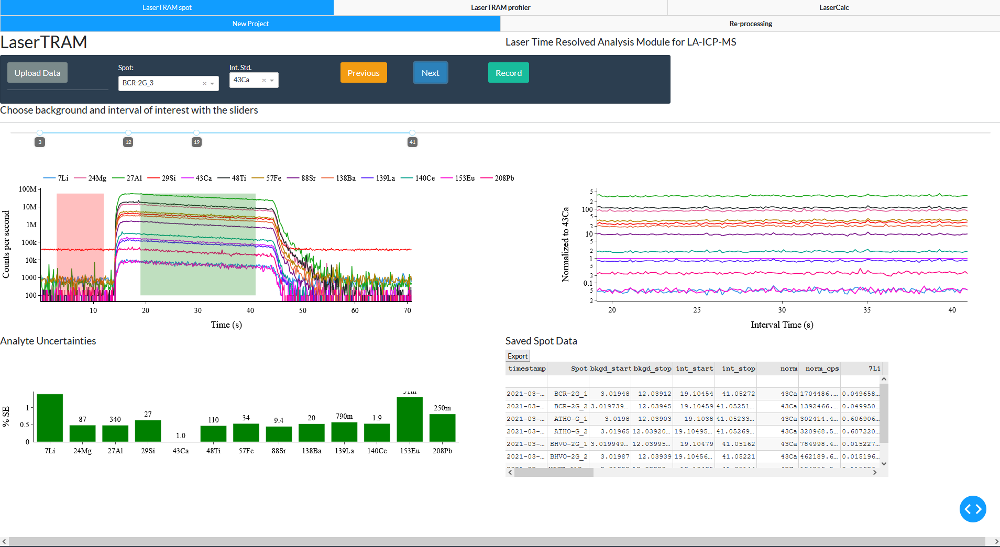
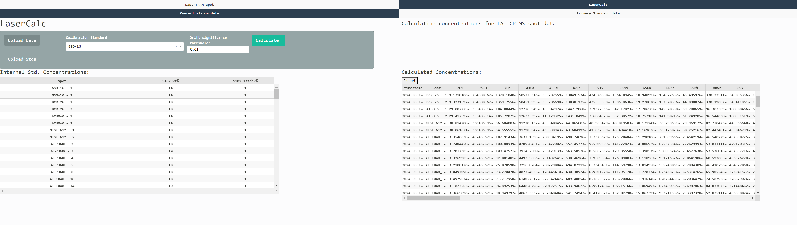

# `LaserTRAM-DB`: A dashboard for the complete laser ablation icp-ms data reduction pipeline.


[](https://doi.org/10.5281/zenodo.8329594)


Paper on EarthArXiv: [https://doi.org/10.31223/X5QG95](https://eartharxiv.org/repository/view/2839/)

[Documentation](https://github.com/jlubbersgeo/laserTRAM-DB/blob/main/docs/LaserTRAM_DB_documentation.pdf)

**_Note_** `LaserTRAM-DB` is still in development and new features are being added (we are happy to take suggestions!). While this is the case, the underlying math and data produced by the software are still accurate. Functionalities being added are those that fall into the following areas:

- signal despiking
- region omission within selected area

_Happy processing!_ <br> -`Jordan`

## Summary

LaserTRAM-DB is a dashboard for the complete processing pipeline of Laser Ablation Inductively Coupled Plasma Mass Spectrometry (LA-ICP-MS) data in complex materials such as geologic samples. As LA-ICP-MS data in geologic samples frequently have multiple phases, inclusions, and other compositional complexities within them that do not represent the material of interest, user interaction is required to filter unwanted signals out of the overall ablation signal. LaserTRAM-DB allows the user to filter which portion of the ablation peak is utilized in calculating concentrations, subsequently allowing for more accurate data to be obtained. It allows easy inspection of any sort of calculation done to the data and just about everything is exportable from tables displayed within the dashboard.

It is comprised of 2 parts:

1. **LaserTRAM:** Choosing an interval of interest from raw cps data in individual spot analyses and normalizing it to an internal standard.



1. **LaserCalc:** Takes the output from either LaserTRAM or LaserTRAM profiler and converts the normalized data into concentrations using the equations outlined below.



## Installation and Use

LaserTRAM-DB can be installed locally and run by creating a virtual environment using the provided `yml` file. If you are new to python, we recommend doing this through [Anaconda](https://conda.io/projects/conda/en/latest/user-guide/tasks/manage-environments.html#creating-an-environment-from-an-environment-yml-file).

```
git clone https://github.com/jlubbersgeo/laserTRAM-DB
cd /path/to/laserTRAM-DB
conda env create -f environment.yml
conda activate lasertram-db
python lasertram-db.py
```

Alternatively, you may run the `lasertram-db.py` script through any Python IDE: VSCode, JupyterLab, etc. After running the script, the dashboard will open in the browser. Because it is browser hosted, all data uploaded into the dashboard are stored there. _This means hitting the refresh button will completely clear and delete all data...you've been warned_.

### Caveats

If you are on a computer where you do not have admin permissions, `git` may not be installed when you create a new virtual environment. A workaround for this is simply downloading the repository as a zip file and unpacking. This will accomplish the same task as:

```
git clone https://github.com/jlubbersgeo/laserTRAM-DB
```

### Windows `exe` file

Optionally, for those using Windows operating systems, `LaserTRAM-DB` can be run through an executable app downloaded [here](https://drive.google.com/drive/folders/1vECM690szcXf54rm-DI3Hz1OH5BAJYjq?usp=sharing). Download the zip file, unpack it, and follow the README instructions included to create a Desktop icon that runs the dashboard.

## Data input format

Initially, LaserTRAM requires a single spreadsheet upload that looks like:
| timestamp | SampleLabel | Time | analyte 1 | ... | analyte n |
|:-------------------:|:-----------:|:-----:|:---------:|:---:|:---------:|
| 2022-10-10 22:44:00 | GSE-1G_1 | 13.24 | 100000 | ... | 100 |

All standard reference materials should be appropriately named. More specifically, their GEOREM name should be somewhere in the actual string:

For example if our standard is GSE-1G:

- okay: GSE-1G-10, GSE-1G-iheartlasers
- not okay: GSE1G, literally anything that doesn't have GSE-1G in it

If they are not appropriately named they will be treated as unknowns and not available as calibration standards.

If you are using either a Thermo iCAP series or Agilent 8900 QQQ quadrupole mass spectrometer there is a small app called `multifiler` that can do this for you [here](https://drive.google.com/drive/folders/1vECM690szcXf54rm-DI3Hz1OH5BAJYjq?usp=sharing) or you can get it at the GitHub repo [here](https://github.com/jlubbersgeo/multifiler).

## Calculations

All calculations are done under the hood using the package [`lasertram`](https://jlubbersgeo.github.io/lasertram/). In many ways you can think about `LaserTRAM-DB` as a wrapper to `lasertram` that is designed to offer better interactivity with no scripting.

- [mathematical background](https://jlubbersgeo.github.io/lasertram/explanation/)

Should you wish to build your own scripts or dashboard, a basic walkthrough of the workflow is here:

- [walkthrough](https://jlubbersgeo.github.io/lasertram/lasertram_tutorial/)

## Demos

Video tutorials on how to use each piece of software can be found at the following links:

- [LaserTRAM video](https://youtu.be/CF6Jjfk9UWA)
- [LaserCalc video](https://youtu.be/7W3_tyhZTmg)

## Quickstart

With LaserTRAM-DB up and running, to get started, please watch the videos above in the Demos section. After that, sample data may be found in the "tests" folder:

- LaserTRAM test data: `spot_test_timestamp_raw_data.xlsx`
- LaserCalc test data: `spot_test_timestamp_lasertram_complete.xlsx`,`profile_test_lasertram_profiler_complete.xlsx`
- LaserCalc standards data: `laicpms_stds_tidy.xlsx`

## Contributing

[](https://github.com/psf/black)

One of the main goals of this project is to bring increased transparency to the fields that utilize LA-ICP-MS data. As such, we welcome feedback and suggestions to help improve the software! If you wish to be a part of further development, or have ideas for new features please open an [issue](https://github.com/jlubbersgeo/laserTRAM-DB/issues) here on GitHub or reach out to Jordan Lubbers (jlubbers@usgs.gov).
