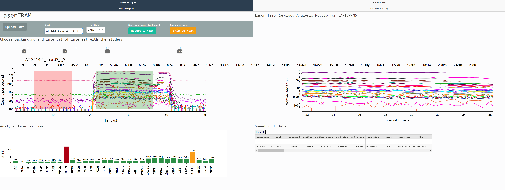
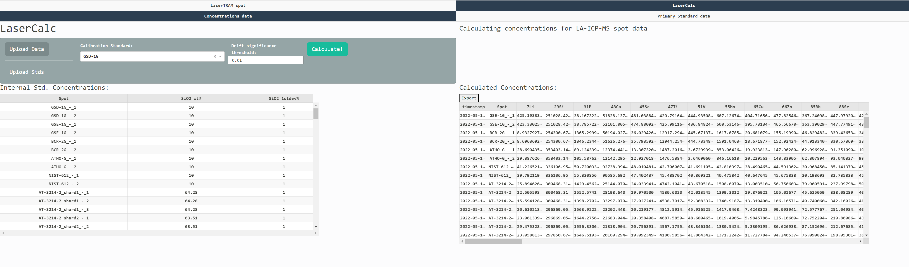

# `LaserTRAM-DB`: A dashboard for the complete laser ablation icp-ms data reduction pipeline.


[](https://doi.org/10.5281/zenodo.8329594)


Paper on EarthArXiv: [https://doi.org/10.31223/X5QG95](https://eartharxiv.org/repository/view/2839/)

[Documentation](https://github.com/jlubbersgeo/laserTRAM-DB/blob/main/docs/LaserTRAM_DB_documentation.pdf)

**_Note_** `LaserTRAM-DB` is still in development and new features are being added (we are happy to take suggestions!). While this is the case, the underlying math and data produced by the software are still accurate. Functionalities being added are those that fall into the following areas:

- Adding metrics for quantifying the degree of spot homogeneity (e.g., MSWD)

_Happy processing!_ <br> -`Jordan`

## Summary

LaserTRAM-DB is a dashboard for the complete processing pipeline of Laser Ablation Inductively Coupled Plasma Mass Spectrometry (LA-ICP-MS) data in complex materials such as geologic samples. As LA-ICP-MS data in geologic samples frequently have multiple phases, inclusions, and other compositional complexities within them that do not represent the material of interest, user interaction is required to filter unwanted signals out of the overall ablation signal. LaserTRAM-DB allows the user to filter which portion of the ablation peak is utilized in calculating concentrations, subsequently allowing for more accurate data to be obtained. Furthermore, it allows for the processing of both individual spot analysis data and a line of spots gathered in rapid succession, reducing the time required for data reduction while preserving spatial definition and still ensuring data quality.

It is comprised of 3 parts:

1. **LaserTRAM:** Choosing an interval of interest from raw cps data in individual spot analyses and normalizing it to an internal standard.



2. **LaserTRAM profiler:** Functionally the same as LaserTRAM, however has tools that allow for the rapid inspection of a line of spot analyses gathered in quick succession.


3. **LaserCalc:** Takes the output from either LaserTRAM or LaserTRAM profiler and converts the normalized data into concentrations using the equations outlined below.



## Installation and Use

LaserTRAM-DB can be installed locally and run by creating a virtual environment using the provided `yml` files. If you are new to python, we recommend doing this through [Anaconda](https://conda.io/projects/conda/en/latest/user-guide/tasks/manage-environments.html#creating-an-environment-from-an-environment-yml-file).

### On Windows:

```
git clone https://github.com/jlubbersgeo/laserTRAM-DB
cd /path/to/laserTRAM-DB
conda env create -f lasertram-db_windows.yml
conda activate lasertram-db_windows
python lasertram-db.py
```

### On Mac:

```
git clone https://github.com/jlubbersgeo/laserTRAM-DB
cd /path/to/laserTRAM-DB
conda env create -f lasertram-db_mac.yml
conda activate lasertram-db_mac
python lasertram-db.py
```

When the program is running, copy and paste the provided link provided in the terminal window into the browser window and the app will run. You can stop the program using `ctrl+c` on MacOS or `exit()` followed by the return button on Windows. To then exit the virtual environment:

```
conda deactivate
```

From now on any time you wish to use the program, simply re-activate the virtual environment and run the script like above

### Caveats

If you are on a computer where you do not have admin permissions, `git` may not be installed when you create a new virtual environment. A workaround for this is simply downloading the repository as a zip file and unpacking. This will accomplish the same task as:

```
git clone https://github.com/jlubbersgeo/laserTRAM-DB
```

### Windows `exe` file

Optionally, for those using Windows operating systems, `LaserTRAM-DB` can be run through an executable app downloaded [here](https://drive.google.com/drive/folders/1vECM690szcXf54rm-DI3Hz1OH5BAJYjq?usp=sharing). Download the zip file, unpack it, and follow the README instructions included to create a Desktop icon that runs the dashboard.

## Data input format

Initially, LaserTRAM requires a single spreadsheet upload that looks like:
| timestamp | SampleLabel | Time | analyte 1 | ... | analyte n |
|:-------------------:|:-----------:|:-----:|:---------:|:---:|:---------:|
| 2022-10-10 22:44:00 | GSE-1G_1 | 13.24 | 100000 | ... | 100 |

If you are using either a Thermo iCAP series or Agilent 8900 QQQ quadrupole mass spectrometer there is a small app called `multifiler` that can do this for you [here](https://drive.google.com/drive/folders/1vECM690szcXf54rm-DI3Hz1OH5BAJYjq?usp=sharing) or you can get it at the GitHub repo [here](https://github.com/jlubbersgeo/multifiler).

## Internal Standards

While you can technically use any analyte for an internal standard in `LaserTRAM` (i.e., it will still generate a ratio normalized to any analyte in the experiment), concentrations will only be calculated in `LaserCalc` from internal standards that can be make the following oxides:

- SiO2 (e.g., 29Si)
- TiO2 (e.g., 47Ti)
- Al2O3
- Cr2O3
- MnO
- FeO
- K2O
- CaO (e.g. 43Ca)
- Na2O
- NiO

**_Just because you can doesn't mean you should_**. Ideally the internal standard analyte is one in which the concentration is well constrained already (i.e., in silicate minerals 29Si is a great option).

## Demos

Video tutorials on how to use each piece of software can be found at the following links:

- [LaserTRAM video](https://youtu.be/CF6Jjfk9UWA)
- [LaserCalc video](https://youtu.be/7W3_tyhZTmg)

## Quickstart

With LaserTRAM-DB up and running, to get started, please watch the videos above in the Demos section. After that, sample data may be found in the "tests" folder:

- LaserTRAM test data: `spot_test_timestamp_raw_data.xlsx`
- LaserTRAM profile test data: Any of the following files: `ATHO-G-7.csv`, `BCR-2G-12.csv`,`BCR-2G-1.csv`,`BHVO-2G-3.csv`,`unknown_nist.csv`
- LaserCalc test data: `spot_test_timestamp_lasertram_complete.xlsx`,`profile_test_lasertram_profiler_complete.xlsx`
- LaserCalc standards data: `laicpms_stds_tidy.xlsx`

## Contributing

[](https://github.com/psf/black)

One of the main goals of this project is to bring increased transparency to the fields that utilize LA-ICP-MS data. As such, we welcome feedback and suggestions to help improve the software! If you wish to be a part of further development, or have ideas for new features please open an [issue](https://github.com/jlubbersgeo/laserTRAM-DB/issues) here on GitHub or reach out to Jordan Lubbers (jlubbers@usgs.gov).
