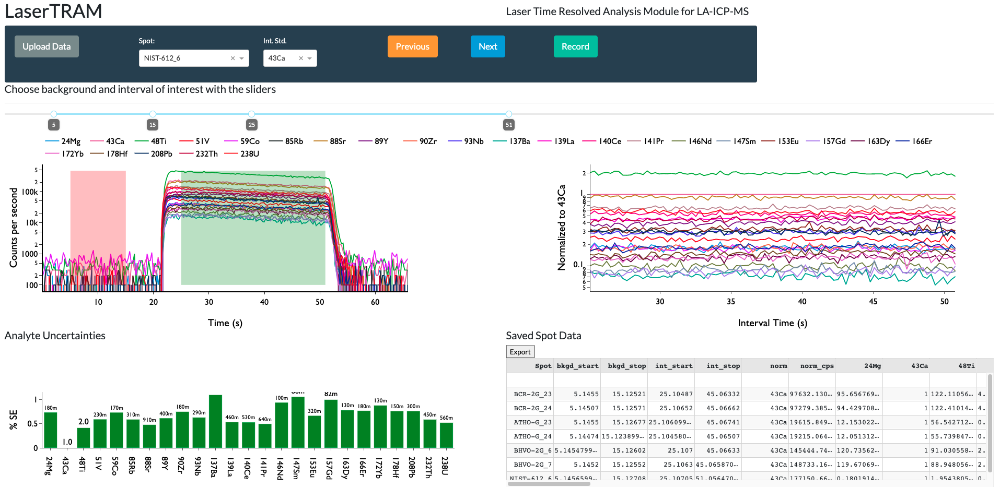

# Summary

LaserTRAM-DB is a dashboard for the complete processing pipeline of Laser Ablation Inductively Coupled Plasma Mass Spectrometry (LA-ICP-MS) data in complex materials such as geologic samples. As LA-ICP-MS data in geologic samples frequently have multiple phases, inclusions, and other compositional complexities within them that do not represent the material of interest, user interaction is required to filter unwanted signals out of the overall ablation signal. LaserTRAM-DB allows the user to filter which portion of the ablation peak is utilized in calculating concentrations, subsequently allowing for more accurate data to be obtained. Furthermore, it allows for the processing of both individual spot analysis data and a line of spots gathered in rapid succession, reducing the time required for data reduction while preserving spatial definition and still ensuring data quality.

# Statement of Need

With a wide array of applications in the natural sciences [e.g., @caricchi2020data; @fritz2021preferential; @loewen2012sources; @lukacs2021zircon], laser ablation inductively coupled plasma mass spectrometry (LA-ICP-MS) is a now a commonplace tool for the gathering of *in situ* trace element (i.e., < 0.1 wt%) data from solid materials. The last two decades have seen significant advances in both instrument capabilities and operating software, allowing users to generate large volumes of *in situ* geochemical data in comparatively little time to previous methodologies (i.e., micro-drilling) while still maintaining high degrees of accuracy and precision.

Raw data output from LA-ICP-MS, however, is in the form of counts per second (cps) for the selected analyte isotopes, not elemental concentrations. In order to be converted into accurate concentrations, a modest amount of user input and interpretation is required and should not be automated. Currently, there are several proprietary and open-source softwares for LA-ICP-MS data reduction to accomplish this task: SILLS - @guillong2008appendix; Iolite -  @paton2011iolite; LAtools - @branson2019latools; Termite - @mischel2017termite; GLITTER - Macquarie University GEMOC; and countless other “in house” spreadsheet-based tools. All have their strengths and weaknesses, however, there is yet to be a powerful, web-hosted Graphical User Interface (GUI) e.g., \autoref{lasertram_gui}. Built primarily using Plotly-Dash [Plotly Technologies @plotly], Numpy [@harris2020array], and pandas [@mckinney2010data], we present a completely open-source dashboard: Laser Time Resolved Analysis Module Dashboard (LaserTRAM-DB) that allows the user to calculate concentrations from raw LA-ICP-MS data with the flexibility of a GUI interface while maintaining the performance of the numerical python ecosystem. Furthermore, by simultaneously displaying both raw data cps and internal standard normalized cps, it allows for rapid decision making about data quality to be determined. It is comprised of three parts:

1. **LaserTRAM:** Choosing an interval of interest from raw cps data in individual spot analyses and normalizing it to an internal standard.

2. **LaserTRAM profiler:** Functionally the same as LaserTRAM, however has tools that allow for the rapid inspection of a line of spot analyses gathered in quick succession.

3. **LaserCalc:** Takes the output from either LaserTRAM or LaserTRAM profiler and converts the normalized data into concentrations using the equations outlined below.

# Governing Equations

We calculate the concentration of analyte ($i$) in an unknown material ($u$) using the following relationship from  @longerich1996inter:
$$
{C_i}^u = \frac{{R_i}^u}{S} \tag{1}
$$

Where ${C_i}^u$ and ${R_i}^u$ are the concentration of analyte and count rate of analyte ($i$) in the unknown material, respectively, and $S$ is the normalized sensitivity. When using naturally occuring internal standards, $S$ can be defined as:
$$
S = \frac{{R_i}^{std}}{{C_i}^{std}}\left[\frac{{R_{n}}^u}{{R_{n}}^{std}} \frac{{C_{n}}^{std}}{{C_{n}}^{u}} \right]  \tag{2}
$$

${R_i}^{std}$ and ${C_i}^{std}$ are the count rate and and concentration of analyte ($i$) in the calibration standard, ${R_{n}}^u$ and ${R_{n}}^{std}$ are the mean count rates of the internal standard in the unknown material and calibration standard, ${C_{n}}^{u}$ and ${C_{n}}^{std}$ are the concentrations of the internal standard in the unknown material and calibration standard.

@kent2006analysis re-arrange this relationship such that the count rate expressions always contain unknown analytes in the numerator:
$$
{C_i}^u = {C_n}^u \frac{\left[\frac{{C_i}^{std}}{{C_n}^{std}}\right]}{\left[\frac{{R_i}^{std}}{{R_n}^{std}}\right]}\frac{{R_i}^u}{{R_{n}}^u} \tag{3}
$$

## Determining Normalized Ratios

The purpose of LaserTRAM-DB is to give the user complete control over which portion of the analytical spectra gets used in calculating concentrations (e.g., filtering out portions of the signal not reflective of the material under investigation). In complex natural materials, selection of this interval and an overall judgement about data quality require an operator to make a decision. This sofware is optimized to allow that decision to be made as efficiently and rapidly as possible.

When a given interval from the analytical spectra has been chosen, every analyte is normalized to a chosen internal standard. LaserTRAM-DB allows for any analyte in the experiment to be used as the internal standard. Prior to normalization to an internal standard, raw data first has the background analyte levels subtracted from it. Background is determined by taking the median counts per second value for each analyte over the specified background range. Once data have been background subtracted, each normalized ratio is calculated the following way:

$$
N_i = median\left[\frac{cps_{i}}{cps_{is}}\right] \tag{4}
$$

Where $cps_i$ is the background subtracted counts per second data for analyte ($i$), and $cps_{is}$ is the background subtracted counts per second data for the internal standard. Since counts per second is analogous to count rate above in Equation 3, we can simplify the above relationship to now reflect our $N_i$ values:
$$
{C_i}^u = {C_n}^u \frac{\left[\frac{{C_i}^{std}}{{C_n}^{std}}\right]}{{N_{i}}^{std}}{N_{i}}^u \tag{5}
$$

Here, ${N_{i}}^{std}$ and ${N_{i}}^{u}$ are the normalized counts per second value of analyte $i$ in the calibration standard and unknown, respectively. The uncertainty for any given normalized ratio is expressed as:

$$
SE = \frac{\sigma_{N_i}}{\sqrt{n}} \tag{6}
$$

$\sigma_N$ is the standard deviation of a given analyte's normalized ratio for the interval and $n$ is the number of time steps in the interval (i.e., cycles through the mass range). The relative standard error is then:

$$
{RSE_i}^u = \left[\frac{SE}{N_i}\right]100 \tag{7}
$$

Detection limits for each analyte are 3 standard deviations above the mean of the background levels as defined earlier. This reflects 99.7\% confidence that the analyte is above background levels. This is standard practice in LA-ICP-MS data reduction. To reflect this in data output, normalized ratios below detection limit are coded to show up as negative ratios in LaserTRAM that then get turned into "b.d.l." values in LaserCalc.

## Concentrations of internal standard in unknown

To calculate concentrations of a given analyte list in an unknown sample, the concentration of the internal standard must be known. LaserCalc takes these concentrations in the form of wt\% oxide and utilizes user interaction to input concentrations of the internal standard and its relative uncertainty. A default value of 1\%  is used for this, but may be updated by the user.

## Drift Correction

To check for drift in calibration standard normalized ratios over time, a linear regression is applied to the calibration standard for each analyte, where the dependent variable is the count rate normalized to the internal standard and the independent variable is the analysis number. This regression and the observed data then receive a Root Mean Squared Error (RMSE)  value. A linear drift correction is applied to an analyte if the relative RMSE value for a given analyte is less than the RSE. Here RSE is defined as:

$$
{RSE_{i}}^{std} = \left[\frac{\frac{\sigma_i}{\sqrt{n_i}}}{\mu_i}\right]100 \tag{8}
$$
Where $\sigma_i$ and $\mu_i$ are the standard deviation and mean of all of the calibration standard normalized ratios respectively and $n_i$ is the total number of calibration standard analyses for analyte ($i$).

In brief, the only way drift correction happens is if there is a sufficiently large linear change in normalized count rates for the calibration standard over time that causes the RMSE of the regression to have lower values than the standard error of the mean. This drift correction then uses the regression parameters (e.g., slope and intercept) to calculate a normalized count rate for the calibration standard at the point in time where an unknown was analyzed:

$$
 {C_i}^u = {C_n}^u \frac{\left[\frac{{C_i}^{std}}{{C_n}^{std}}\right]}{\left[m_ix +b_i\right]}{N_i}^u \tag{9}
$$

Where $m$ is the regression slope, $x$ is the analysis number, and $b$ is the intercept for analyte $i$.

## Uncertainties

Calculating concentrations of a given analyte in an unknown material can be considered a series of nested quotients and products. Therefore, we quantify the overall uncertainty of a given analyte as [@taylor1997introduction p.61]:

$$
\sigma_{C_i} = {C_i}^u \sqrt{ \left( \frac{\sigma_{{C_u}^{n}}}{{C_u}^{n}}\right)^2 + \left( \frac{\sigma_{{C_i}^{std}}}{{C_i}^{std}}\right)^2 + \left( \frac{\sigma_{{C_n}^{std}}}{{C_n}^{std}}\right)^2 + \left({RSE_i}^{std}\right)^2 + \left({RSE_i}^{u}\right)^2} \tag{10}
$$

For analytes where drift correction has been applied, ${RSE_i}^{std}$ is replaced with:

$$
100\left[\frac{RMSE_i}{\mu_i}\right]
$$

Where $RMSE_i$ is the Root Mean Squared Error as specified in the Drift Correction section.

# Data Output

Both steps of the data processing pipeline (e.g., LaserTRAM and LaserCalc) allow the user to output progress in the form of an Excel spreadsheet that mimics the application datatable hosted in the web browser. Output follows tidy data format [@wickham2014tidy] where columns contain observation attributes (i.e., analytes values and associated metadata) and rows denote observations (i.e., an individual spot analysis).

# Acknowledgements

We express our gratitude to the W.M. Keck Foundation for helping foster the labarotory environment that led to the genesis of this software as well as NSF project grants 1763639, 1948862,  and 1654275.

# References
